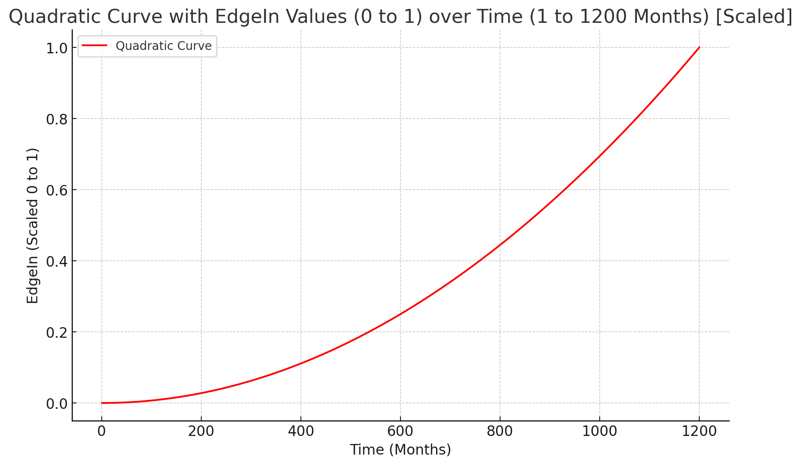

# EdgeIn Protocol

Edgein Protocol provides a mechanism to control data access and value, where users can stake, validate and earn in a social data marketplace.   In EdgeIn Protocol, data assets are the RWA, or Real World Asset, and the protocol provides dynamic pricing and earning opportunities in a DeFi-enabled environment.   The EdgeIn Protocol allows users to publish, exchange, and consume data in a sustainable economic framework.  Buying a share of a dataset gives you access and a license to its use, but it could be speculative as data assets appreciate and depreciate. &#x20;

EdgeIn Protocol makes publishing and consuming data services accessible.  EdgeIn is designed to have a very long duration of increasing value for data and services, thus, a slow edge or slope of the curves underlying protocol assets; asset publishers can control their own price and market value.  The EdgeIn Protocol provides data access services and a DeFi mechanism for dynamic pricing.  EdgeIn Protocol is an evolutionary approach to social pricing and decentralized data services to create a sustainable application framework for data marketplaces.

_**Edge In - Don't Ape In**_

The EdgeIn protocol solves the problem of long-term and short-term asset valuation by enabling a new approach to pricing where a community determines value.  Friend.Tech epitomizes the get-rich-quick approach of Aping In with an immutable, steep valued curve:

<figure><figcaption>
The Friend.Tech curve is based on the formula <code>Price in ETH = (Number of Shares)² / 16000</code>, illustrating how the price in ETH changes with the number of shares.  This curve is immutable in Friend.Tech.
</figcaption></figure>

EdgeIn Protocol can provide a steep curve but also accommodates slow growth, flash-fads, and pop-culture meme-fueled valuations that can be changed over time.  The EdgeIn protocol is an asset price variable based on time and mutable, thus empowering value creators to price their work accordingly.

EdgeIn assets can be valued within 1-1200 months and provide incentives for creating assets valued by a community for 100 years or more.

<figure><figcaption></figcaption></figure>

© 2024 EdgeIn Protocol Limited
