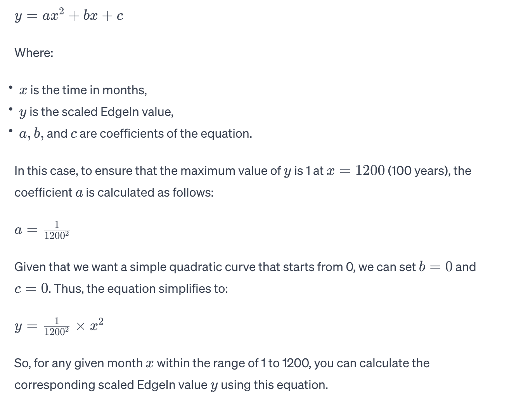
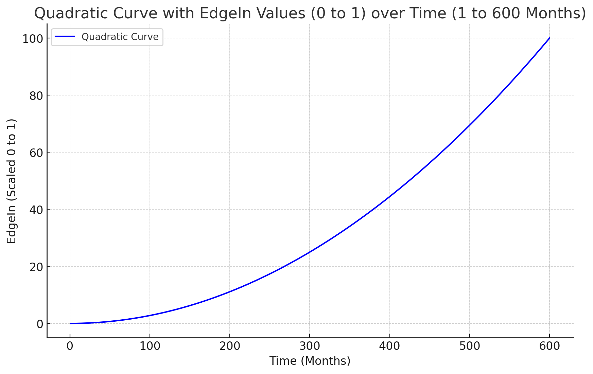

# EdgeIn, veEdgeIn, Data NFTs

EdgeIn Protocol is an on-ramp and off-ramp for valuable data assets in crypto ecosystems, using data NFTs and datatokens to interact with decentralized data services.  A data NFT is a non-fungible token representing a valued data set associated with actual information, which may be used with a data service defined by this protocol. &#x20;

A data token is a fungible token for a given data service, which means you can access the service; it's a license over the underlying data you will interact with in any given data service.  Data services may persist over time, and significant data sets are generational (50 years) or multi-generational (more than 100 years).  However, the mark of a genuinely generational data set is that buyers buy over long periods, decades, versus mere months or years.

Each data service gets its data NFT and designates a bonding curve - price - that each user wants to set for their data NFT.  Bonding curves in the EdgeIn protocol are time-based, and the data publisher can select from 1-1200 months, with 25, 50-year "Generational" and 100-year "Multi-Generational" bonding curves as options for each data NFT.  If they like, publishers of data NFTs may rebase or reprice them at any time.  &#x20;

Staking EdgeIn generates veEdgeIn - Voting EdgeIn, which can be used in the EdgeIn governance platform.  Using veEdgeIn, community members can determine the roadmap and direction of the platform by engaging in our governance system.  Staking EdgeIn for veEdgeIn is accomplished by locking tokens from 1 to 1200 months ( 1 month to 100 years) and is rewarded with a multiplier for every five years of staking, up to 20 times the staked amount for 100-year locks.  veEdgeIn can be redeemed anytime or unstaked, thus relieving the user of assets or data sets they would control or manage.

Fees are charged and split between protocol and publishers on a 97%/3% (3% Protocol Fee).  Additionally, publishers pay a percentage out to validators for their work.

EdgeIn smart contracts (Solana Programs) make it easy to publish both data  NFTs and data services (deploy and mint data NFTs and datatokens) and consume data services (spend datatokens). This allows EdgeIn to have a composable, simple setup and makes EdgeIn Protocol a set of tools rather than a platform.\
\
Variable, rebasable quadratic curve to 100 years:

<figure><figcaption>
Rebasable Share Curve for EdgeIn
</figcaption></figure>

50-year "Generational" bonding curve for purchasing data NFTs.

<figure><figcaption>
Here's the graph of the quadratic curve for 50 years (600 months). The Y-axis is labeled 'EdgeIn' and scaled from 0 to 1, and the X-axis represents the time from 1 to 600 months. This curve demonstrates the quadratic progression of EdgeIn values over a 50-year timeframe.
</figcaption></figure>

100-year "Multi-Generational" bonding curve for purchasing data NFTs (Default)

<figure><figcaption>
The X-axis still represents time from 1 to 1200 months, while the Y-axis appropriately scales the EdgeIn values from 0 to 1. This graph accurately shows the quadratic progression of EdgeIn values over a century, with the maximum value capped at 1.
</figcaption></figure>

**Staking Multiplier**

veEdgeIn multiplier up to 20x for 5-year increments (20 x 5 = 100) with no incentives from 1-59 months.

| Duration in Years     | veEdgeIn Multiplier |
| --------------------- | ------------------- |
| 5 Years (60 Months)   | 20x                 |
| 10 Years (120 Months) | 30x                 |
| 15 Years (180 Months) | 40x                 |
| 20                    | 50x                 |
| 25                    | 60x                 |
| 30                    | 70x                 |
| 35                    | 80x                 |
| 40                    | 90x                 |
| 45                    | 100x                |
| 50                    | 110x                |
| 55                    | 120x                |
| 60                    | 130x                |
| 65                    | 140x                |
| 70                    | 150x                |
| 75                    | 160x                |
| 80                    | 170x                |
| 85                    | 180x                |
| 90                    | 190x                |
| 95                    | 200x                |
| 100 (1200 Months)     | 210x                |

© 2024 EdgeIn Protocol Limited
