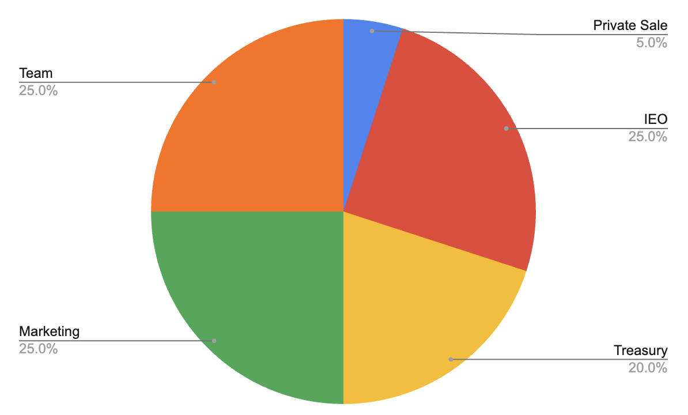

# Tokenomics

Token Address:     [2HT3GCwdeT41CASnKZME6pgTh18QtK4Nkx7MVr8ufiwL](https://explorer.solana.com/address/2HT3GCwdeT41CASnKZME6pgTh18QtK4Nkx7MVr8ufiwL)

DAO Multisig:        [H5GdfNPaaEjDwoAJkU1CnmpeXKouYM73d7HUULdMrKkW](https://explorer.solana.com/address/H5GdfNPaaEjDwoAJkU1CnmpeXKouYM73d7HUULdMrKkW)

Github:                   [https://github.com/EdgeIn-DAO/](https://github.com/EdgeIn-DAO/)\
Whitelist:               [Whitelist Form](https://co11.co/8FSo7)\
Token Ticker:                          EdgeIn\
Category:                                Web3 Social\
Blockchain:                             Solana\

Private Rounds&#x20;

Jan 1, 2024 - Dec 31, 2024&#x20;

| Stage                 | Amount |
| --------------------- | ------ |
| Private Rounds        | 25%    |
| Public Launch         | 5%     |
| Treasury              | 20%    |
| Marketing & Community | 25%    |
| Team                  | 25%    |

<figure><figcaption>
EdgeIn DAO Tokenomics
</figcaption></figure>

The EdgeIn Tokenomics plans for a private sale, a public sale, and 5 years of operations.

Private Sale:  Up to 5% will be offered to private investors

IEO:  Planned public sale in the future

Treasury:  Withheld from market

Marketing & Community:  5-years of community incentives

Team: 5-years of team incentives

© 2024 EdgeIn Foundation&#x20;
